# Guía Git/GitHub - SOCRATECH

## Introducción

En este repositorio dispones de una guía de uso básica sobre Git y GitHub en la que podrás aprender aspectos clave como la instalación, configuraciónes, comandos más comunes, etc.

**Todo lo descrito en esta guía tendrá que ser usado a través de una terminal**, pero si lo deseas Git también puede ser usado en un gran número de [interfaces gráficas](https://git-scm.com/downloads/guis).

El material está basado en documentación oficial de Git, diversos tutoriales y en nuestra propia experiencia como formadores.

También hemos grabado diferentes tutoriales, los cuales podéis ver en esta [lista en nuestro canal de Youtube](https://www.youtube.com/watch?v=j-W3D0efSIk&list=PLu92OXKwcPyQOM2uf04bWlocmVz7KbITT).

Si te ha gustado esta guía guárdate el repositorio como favorito dándole a la ⭐️ y compártela con tus conocidos.

<details>
  <summary style='font-weight: bold'>Tabla de contenidos</summary>

1. [¿Qué es Git?](#qué-es-git)
2. [Instalación](#instalación)
3. [Configuración](#configuración)
   - [Configuraciones globales](#configuraciones-globales)
   - [Configuración de claves SSH (Opcional)](#configuración-de-claves-ssh-opcional)
4. [Comandos sistema de archivos](#comandos-sistema-de-archivos)
   - [Información](#información)
   - [Archivos y carpetas](#archivos-y-carpetas)
5. [Comandos Git](#comandos-git)
   - [Iniciar repositorio y ver su estado](#iniciar-repositorio-y-ver-su-estado)
   - [Seguimiento de archivos](#seguimiento-de-archivos)
   - [Commits](#commits)
   - [Repositorio remoto (GitHub)](#repositorio-remoto-github)
   - [Ramas](#ramas)
   - [Alias](#alias)
   - [Stash](#stash)
6. [Ignorar archivos](#ignorar-archivos)
7. [Preguntas frecuentes](#preguntas-frecuentes)
   - [Preguntas sobre Git](#preguntas-sobre-git)
   - [Preguntas sobre GitHub](#preguntas-sobre-github)
8. [Sobre nosotros](#descubre-más-sobre-nosotros)
</details>

## ¿Qué es Git?

Git es un sistema de **control de versiones**, una herramienta que los desarrolladores de software utilizamos para **gestionar y hacer un seguimiento de los cambios en el código fuente a lo largo del tiempo**.

Con Git, puedes **guardar diferentes versiones** de tu proyecto, **revertir a versiones anteriores** si algo sale mal, y **trabajar en equipo de manera más eficiente**. Cada cambio que haces se registra en un historial, lo que te permite ver qué modificaciones se han hecho, cuándo, y por quién.

Git es especialmente útil cuando se trabaja en **proyectos de programación colaborativos**, ya que facilita la integración de aportes de diferentes personas sin que se pierdan cambios o se generen conflictos en el código.

[⬆️ Volver a inicio](#introducción)

## Instalación

Si no sabes si ya tienes instalada una versión de Git, puedes comprobarlo con alguno de los siguientes comandos:

```bash
git -v
```

```bash
git --version
```

Puedes comprobar cual es la última versión disponible desde la [web oficial](https://git-scm.com/).

Si no lo tienes instalado, lo primero será realizar la instalación.

- **Windows:** Tan solo hay que descargar el [instalador oficial](https://git-scm.com/download/win) y seguir los pasos. Normalmente se suelen dejar las configuraciones que vienen por defecto, pero si tienes que elegir tu editor de código cuando te pregunte. Una vez finalizada la instalación ya podrás hacer uso de Git y d ela terminal Git Bash.

- **Mac:** En [este vídeo](https://www.youtube.com/watch?v=KiHVmWr_bBY) lo explico paso a paso usando el gestor de paquetes Homebrew.

Para los repositorios remotos haremos uso de la plataforma GitHub, por lo que si todavía no has creado una cuenta, puedes hacerlo desde [aquí](https://github.com/signup?ref_cta=Sign+up&ref_loc=header+logged+out&ref_page=%2F&source=header-home). Es un proceso muy sencillo, pero si te surge algún incoveniente te dejo también [este vídeo](https://www.youtube.com/watch?v=dGIsU9F4yW0) donde lo explico paso a paso.

[⬆️ Volver a inicio](#introducción)

## Configuración

### Configuraciones globales

Para poder usar Git necesitarás hacer un par de **configuraciones mínimas**. Estas configuraciones solo habrá que realizarlas una vez.

Configura el **nombre de usuario y correo electrónico**. Git los usará para identificar a quien pertenecen los commits. Los commits serán las versiones de nuestro código, lo cual veremos en detalle más adelante.

Configura tu nombre de **usuario global**:

```bash
git config --global user.name "nombre"
```

Configura tu **email global**:

```bash
git config --global user.email "email"
```

Puedes comprobar el **listado de configuraciones** aplicadas con el comando:

```bash
git config --list
```

Otra configuración que suelo realizar en mis clases es la de modificar el nombre de la rama principal al crear un repositorio. Antes se recomendaba usar el nombre **master**, pero actualmente la recomendación es que sea **main**, por lo que de esta manera aseguramos que siempre será así, coincidiendo con el nombre de la rama en el repositorio remoto.

Configura de forma global que el **nombre de la rama por defecto** sea "main":

```bash
git config --global init.defaultBranch main
```

Los **finales de línea** son gestionados de manera distinta entre sistemas operativos. Mientras que **Windows utiliza CRLF** (Carriage Return + Line Feed) como terminador de línea, los sistemas basados en **Linux y macOS utilizan solo LF** (Line Feed). Esta diferencia **puede generar conflictos al trabajar en proyectos colaborativos** donde se utilizan múltiples sistemas operativos.

Para **evitar estos conflictos**, Git ofrece configuraciones que permiten un manejo coherente de los finales de línea al compartir código entre diferentes plataformas.

**Mac / Linux**

En estos sistemas, puedes configurar Git para que mantenga los finales de línea como LF al confirmar cambios y convertirlos automáticamente en CRLF al extraerlos en un entorno Windows.

```bash
git config --global core.autocrlf input
```

**Windows**

En Windows, se recomienda configurar Git para convertir automáticamente los finales de línea de LF a CRLF al extraer archivos, y revertirlos a LF al confirmar los cambios. Esto asegura que los archivos mantengan el formato adecuado para cada sistema.

```bash
git config --global core.autocrlf true
```

Estas son solo algunas de las configuraciones globales que puedes realizar en Git, pero existen muchas más. [Aquí](https://git-scm.com/docs/git-config) puedes acceder a la documentación oficial para ver el listado completo.

[⬆️ Volver a inicio](#introducción)

### Configuración de claves SSH (Opcional)

La vinculación de los repositorios con el protocolo HTTPS es la que tenemos por defecto, por lo que es muy simple de usar.

Sin embargo pos **seguridad y practicidad** el protocolo SSH es **preferible hoy en día**.

Esto permite que nos conectemos a GitHub sin necesidad de estar usando nuetsro usuario y contraseña y nos da la posibilidad de manejar varias cuentas a la vez.

La forma de realizarlo difiere ligeramente si estás usando un SO Mac, Windows o Linux, por lo que te dejo un [enlace](https://docs.github.com/es/authentication/connecting-to-github-with-ssh/about-ssh) con toda la documentación oficial al respecto.

[⬆️ Volver a inicio](#introducción)

## Comandos sistema de archivos

Es muy probable que necesites hacer uso del sistema de archivos a través de la terminal, por lo que aquí tienes un listado con los más habituales.

Estos comandos son para sistemas **Linux**, por lo que si estás usando Windows tendrás que usar la terminal **Git Bash** o instalar **Windows Subsystem for Linux (WSL)**, entre otras opciones.

### Información

#### Ver la ruta actual

```bash
pwd
```

```bash
# EJEMPLO ↓
pwd
# /Users/sergio/Desktop/Códigos/Clases/Git
```

[⬆️ Volver a inicio](#introducción)

#### Ver listado de carpetas y archivos del directorio actual

```bash
ls
```

```bash
# EJEMPLO ↓
ls
# prueba    readme.md
```

[⬆️ Volver a inicio](#introducción)

#### Ver listado de carpetas y archivos del directorio actual, incluidos los ocultos

```bash
ls -a
```

```bash
# EJEMPLO ↓
ls -a
# .DS_Store     .git      prueba    readme.md
```

[⬆️ Volver a inicio](#introducción)

### Archivos y carpetas

#### Moverte a otra carpeta

```bash
cd <nombre-carpeta>
```

```bash
# EJEMPLOS ↓
cd pruebas # Entra a la carpeta "pruebas"
cd pruebas/prueba1 # Entra a la carpeta "prueba1" dentro de "pruebas"

cd .. # Sale una carpeta
cd ../.. # Sale 2 carpetas
```

> [!TIP]
> Puedes entrar y/o salir de tantas carpetas a la vez como desees. Si usas la tecla tab te podrás ayudar del autocompletado.

[⬆️ Volver a inicio](#introducción)

#### Crear una carpeta

```bash
mkdir <nombre-carpeta>
```

> [!IMPORTANT]
> No uses nombres con espacios, símbolos, acentos, letra ñ...

[⬆️ Volver a inicio](#introducción)

#### Crear un archivo

```bash
touch <nombre-archivo>
```

[⬆️ Volver a inicio](#introducción)

#### Ver contenido de un archivo

```bash
cat <nombre-archivo>
```

[⬆️ Volver a inicio](#introducción)

#### Editar un archivo

```bash
nano <nombre-archivo>
```

> Existen diferentes editores como **nano**, **vim** o **gedit**.

[⬆️ Volver a inicio](#introducción)

#### Abrir carpeta en VS Code

```bash
code .
```

> Si no te funciona, tienes que entrar a VS code, abrir la paleta de comandos y ejecutar Install 'code' command in PATH.

[⬆️ Volver a inicio](#introducción)

#### Borrar archivos

```bash
rm <nombre-archivo>
```

> Si intentas borrar un archivo inexistente, recibirás un mensaje de error.

```bash
# EJEMPLO ↓
rm prueba.txt
# rm: prueba.txt: No such file or directory
```

> [!TIP]
> Puedes borrar varios archivos a la vez indicando un nombre detrás de otro o indicando una extensión.

```bash
# EJEMPLO 1 ↓
rm prueba.txt prueba2.txt

# EJEMPLO 2 ↓
rm *.txt
```

> [!TIP]
> Si añades la opción -i te pedirá confirmación para ser borrado.

```bash
# EJEMPLO ↓
rm -i prueba.txt
# remove prueba.txt?
```

[⬆️ Volver a inicio](#introducción)

#### Borrar carpetas

```bash
rm -r <nombre-carpeta>
```

> Este comando borra la carpeta y todo su contenido.

```bash
# EJEMPLO ↓
rm -r pruebas
```

> [!WARNING]
> También se puede usar el comando `rm -rf`, pero estó borrará incluso los archivos protegidos contra escritura.

> [!CAUTION]
> El comando `rm -rf` puede eliminar archivos críticos del sistema y causar daños irreparables. Úsalo con mucho cuidado, especialmente con privilegios de superusuario (root).

[⬆️ Volver a inicio](#introducción)

## Comandos Git

Una vez ya sabes [qué es Git](#qué-es-git), lo has [instalado](#instalación) y has creado la cuenta en un servicio para alojar repositorios en la nube (en nuestro caso, GitHub), has realizado las [configuraciones necesarias](#configuración) y has aprendido a [manejar el sistema de archivos desde la terminal](#comandos-sistema-de-archivos), es hora de darle caña a los comandos de Git (y no serán pocos 😛).

### Iniciar repositorio y ver su estado

#### Crear un repositorio local

Puedes crear un repositorio local en una carpeta vacía o una que ya contenga archivos con el comando ↓

```bash
git init
```

```bash
# EJEMPLO ↓
# Crea la carpeta
mkdir git
# Entra a la carpeta
cd git
# Crea el repositorio local
git init
#Inicializado repositorio Git vacío en /Users/sergio/Desktop/Códigos/Clases/Git/.git/
```

Esto genera una carpeta oculta ".git", la cual contiene todos los datos del repositorio. Por defecto, tal y como configuramos, se creará la rama principal "main".

> [!WARNING]
> Si has creado un repositorio donde no debías puedes borrar la carpeta genera, pero siempre debes estar seguro de esto. Borrar el repositorio hará que pierdas todo el historial de cambios y ya no se podrá recuperar.

[⬆️ Volver a inicio](#introducción)

#### Ver el estado del repositorio

Ya sea tras haber creado el repositorio o en cualquier otro momento, podemos usar el comando `git status`, el cual nos dará información valiosa sobre en que estado se encuentra nuestro repositorio.

Para este ejemplo he creado el archivo "readme.md" y que así no nos aparezca vacío.

```bash
git status
```

```bash
# EJEMPLO tras git init ↓
git status

# En la rama main

# No hay commits todavía

# Archivos sin seguimiento:
  # (usa "git add <archivo>..." para incluirlo a lo que será confirmado)
	# readme.md

# no hay nada agregado al commit pero hay archivos sin seguimiento presentes (usa "git add" para hacerles seguimiento)
```

En este caso nos está diciendo que tenemos el archivo "readme.md" sin hacerle seguimiento y nos da una recomendación sobre cual sería el siguiente paso y el comando a utilizar. Estas recomendaciones las hará siempre (por defecto), algo que suele venir bastante bien.

[⬆️ Volver a inicio](#introducción)

### Seguimiento de archivos

#### Hacer seguimiento a todos los archivos

Una vez tenemos archivos en nuestro repositorio, estos deben de ser puestos en seguimiento (añadidos al área de stage). Esto es un paso intermedio necesario antes de poder realizar un commit (versión).

Se suele ver como que estamos enfocando (stage) a nuestros archivos para despues hacerles la fotografía (commit).

En caso de querer añadir todos los archivos a la vez y estés situado en la raiz, tienes que usar el comando:

```bash
git add .
```

Este comando no nos dará ningún mensaje por consola, pero si usamos el comando `git status` veremos lo siguiente:

```bash
# En la rama main

# No hay commits todavía

# Cambios a ser confirmados:
#  (usa "git rm --cached <archivo>..." para sacar del área de stage)
#  nuevos archivos: readme.md
```

Nos informa que no hay commits creados y nos da un nuevo comando, en este caso, para revertir el paso anterior (lo veremos después). Si hubiese algún archivo sin seguimiento también nos lo indicaría.

Si no estás situado en la raiz, puedes usar:

```bash
git add -A
# o
git add --all
```

[⬆️ Volver a inicio](#introducción)

#### Hacer seguimiento de uno o varios archivos

Puede darse el caso de que no queramos hacer seguimiento de todos los archivos a la vez, por lo que tenemos la opción de hacerlo con un solo archivo o varios. Algunas formas de poder hacerlo son:

```bash
# Añade el archivo indicado
git add <nombre-archivo>
```

```bash
# Añade los archivos indicados
git add <nombre-archivo> <nombre-archivo-2>
```

```bash
# Añade todos los archivos .js
git add *.js
```

[⬆️ Volver a inicio](#introducción)

#### Dejar de hacer seguimiento

A veces, podemos agregar archivos al área de stage por error. Afortunadamente, Git ofrece varias maneras de eliminar estos archivos de la zona de stage sin borrarlos del sistema de archivos. Aquí podrás ver las diferencias entre los comandos disponibles:

\- **Antes de realizar un commit**

Si aún no has creado un commit, puedes sacar un archivo del área de stage usando el siguiente comando:

```bash
git rm --cached <nombre-archivo>
```

> Este comando elimina el archivo del área de stage, pero mantiene el archivo en tu directorio de trabajo. Es útil cuando deseas detener el seguimiento de un archivo que has añadido por error sin eliminarlo de tu proyecto.

Alternativamente, puedes usar:

```bash
git reset <nombre-archivo>
```

> Este comando también elimina el archivo del área de stage, pero adicionalmente restaura el archivo en tu directorio de trabajo a su estado anterior al git add. Es útil si quieres deshacer cualquier cambio hecho después de haber añadido el archivo al stage.

[⬆️ Volver a inicio](#introducción)

\- **Después de realizar un commit**

Si ya has creado un commit, puedes revertir la adición al stage con:

```bash
git restore --staged <nombre-archivo>
```

> Este comando moderno y recomendado, **disponible desde Git 2.23**, elimina el archivo del área de stage sin afectar el estado actual del archivo en tu directorio de trabajo. Es más intuitivo y generalmente preferido para deshacer cambios de stage después de un commit.

Otra opción es:

```bash
git reset <nombre-archivo>
```

> El comportamiento es similar al de `git restore --staged` en este contexto, pero git reset tiene más configuraciones avanzadas que pueden ser más complicadas de manejar. Sin embargo, en este caso simple, el resultado es el mismo.

[⬆️ Volver a inicio](#introducción)

\- **Eliminar todos los archivos del área de stage**

Si deseas sacar todos los archivos del área de stage a la vez, tienes las siguientes opciones:

```bash
git restore --staged .
```

> Este comando moderno y simple, **disponible desde Git 2.23**, elimina todos los archivos del área de stage.

Antes de la introducción de git restore, la opción estándar era:

```bash
git reset
```

> Este comando también elimina todos los archivos del área de stage, pero al igual que con archivos individuales, tiene capacidades avanzadas que pueden ser innecesarias en escenarios simples.

[⬆️ Volver a inicio](#introducción)

### Commits

#### Crear un commit

Una vez hemos añadido al área de stage los archivos a los cuales queremos que Git les haga seguimiento, el siguiente paso es crear el commit (versión).

Para hacerlo tenemos que usar el comando:

```bash
git commit -m "mensaje"
```

> La bandera **-m** o **--message** nos permite introducir un **mensaje** al commit. Todos los commits tienen que llevar un mensaje describiendo los cambios. Si no usamos la bandera se nos abrirá el editor para poder introducirlo.

```bash
# EJEMPLO ↓
git commit -m "first commit"

# [main (commit-raíz) 3135119] first commit
#  1 file changed, 448 insertions(+)
#  create mode 100644 readme.md
```

En este punto, si hacemos un `git status` obtendremos que el árbol de trabajo está limpio.

```bash
git status

# En la rama main
# nada para hacer commit, el árbol de trabajo está limpio
```

Ya se han quedado grabados los cambios en la rama main del repositorio local. Estos cambios podrán ser revertidos haciendo uso de otros comandos. También tendremos comandos para ver el historial de commits y obtener información valiosa de ellos (autor, fecha...).

[⬆️ Volver a inicio](#introducción)

#### Crear commit sin pasar por el área de stage

Si quieres realizar un nuevo commit de archivos que ya estaban en seguimiento, puedes saltarte el paso intermedio de añadirlos al stage añadiendo la bandera **-a** o **--all**.

Esto hará que se realice un commit de los **archivos modificados**. Si hay algún archivo nuevo no lo añadirá al commit, ya que habría que añadirlo al stage con `git add <nombre-archivo>`.

Lo más habitual es usar el comando con las dos banderas juntas. Quedaría así:

```bash
git commit -am "segundo commit"
```

[⬆️ Volver a inicio](#introducción)

#### Modificar el mensaje del último commit

Es posible que al crear un commit te puedas equivocar al escribir el mensaje. En Git tenemos un comando el cual nos permite **modificar el mensaje del commit anterior** si este no se ha enviado todavía al repositorio remoto.

Para ello debereemos usar la bandera **--amend**

```bash
git commit --amend -m "mensaje modificado"
```

[⬆️ Volver a inicio](#introducción)

#### Ver histórico de commits

Una vez tengas uno o más commits podrás hacer uso del comando `git log` para ver el historial e información importante de cada uno de ellos.

Veamos el resultado:

```bash
git log

# commit 6a09acadb40d8e01c13ea0de86e0f2d87f759bf2 (HEAD -> main)
# Author: sergio jimenez <sjr.social@gmail.com>
# Date:   Fri Aug 23 10:01:12 2024 +0200
#
#     segundo commit

# commit 3ca58990e301ea0eac8e3291ae8a4bffd852f8bd
# Author: sergio jimenez <sjr.social@gmail.com>
# Date:   Fri Aug 23 09:57:50 2024 +0200
#
#     first commit
```

En mi caso me enseña los 2 commits que he realizado e indica la siguiente información de cada uno de ellos:

- **Identificador único**, creado de forma aleatoria. Este identificador es útil por si en algún punto necesitas revertir tu código a un commit en concreto. En la primera línea también indica **(HEAD -> main)**. Esto quiere decir que es la versión más reciente y estoy ahí situado.
- **Autor**, muestra el nombre y correo que indicado en la configuración.
- **Fecha** de creación.
- **Comentario** del commit.

Con la bandera `--graph--` mostrará el mismo resultado, pero de una forma un poco más visual, muy util cuando hay diferentes ramas.

```bash
# * commit 6a09acadb40d8e01c13ea0de86e0f2d87f759bf2 (HEAD -> main)
# | Author: sergio jimenez <sjr.social@gmail.com>
# | Date:   Fri Aug 23 10:01:12 2024 +0200
# |
# |     segundo commit
# |
# * commit 3ca58990e301ea0eac8e3291ae8a4bffd852f8bd
#   Author: sergio jimenez <sjr.social@gmail.com>
#   Date:   Fri Aug 23 09:57:50 2024 +0200
#
#       first commit
```

Otra bandera que me resulta bastante útil es `--oneline`. Esto muestra el historial de commits con la versión corta del ID y sin datos de autor y fecha.

```bash
# 6a09aca (HEAD -> main) segundo commit
# 3ca5899 first commit
```

> [!NOTE]
> Para dejar de ver el historial de commits pulsa `control + z`

[⬆️ Volver a inicio](#introducción)

#### Revertir cambios

Es posible que no todos los commits que hayas creado sean correctos, por lo que Git nos ofrece diversas formas de revertirlos según la situación.

Veamos algunas de ellas:

\- **Deshacer un archivo modificado**

Si has estado realizando modificaciones en uno o varios archivos y finalmente decides echar marcha atrás y no guardarlas en un nuevo commit, con el comando `git restore` podrás desacerlos y que vuelvan al estado del último commit.

```bash
# Restaura ese archivo
git restore <nombre-archivo>

# Restaura todo el directorio de trabajo
git restore .

# Restaura todos los archivos con extensión .md
git restore *.md
```

> Este comando moderno y recomendado, **disponible desde Git 2.23**, es más intuitivo y pretende sustituir a como ya se podía hacer con el comando `git checkout`.

Si deseas revertir los cambios a otro commit que no sea exactamente el último, lo puedes hacer así:

```bash
git restore --source=<commit_hash> <archivo>
```

> En ningún momento se ha visto modificado el historial de commits.

[⬆️ Volver a inicio](#introducción)

\- **Deshacer commit**

En el apartado anterior hemos visto como deshacer modificaciones de un archivo y este apartado veremos como deshacer commits, cambiándonos al que necesitemos.

> En esta ocasión si se modificará el historial de commits.

Para ello vamos a usar el comando `git reset`y vamos a ver diferentes modos de usarlo según lo que queramos conseguir:

**--soft:** Mueve el puntero de la rama al commit especificado, pero mantiene los cambios en el área de stage.

```bash
git reset --soft <commit_hash>
```

**--mixed (por defecto):** Mueve el puntero de la rama y deshace los cambios del área de preparación, pero deja los cambios en el directorio de trabajo.

```bash
git reset --mixed <commit_hash>

```

**--hard:** Mueve el puntero de la rama, deshace los cambios del área de preparación y del directorio de trabajo, borrando todos los cambios.

```bash
git reset --hard <commit_hash>
```

Si en vez de indicar el hash del commit queremos indicar que retroceda un nº exacto de veces, podemos hacerlo de la siguiente manera, donde n es el nº de commits a retroceder.

```bash
git reset --soft HEAD~<n>
```

> [!NOTE]
> Estas son solo algunas de las formas mas utilizadas para revertir cambios, pero existen otras opciones según lo que necesitemos conseguir.

[⬆️ Volver a inicio](#introducción)

### Repositorio remoto (GitHub)

Una vez has aprendido a crear un repositorio y a crear y gestionar commmits, es la hora de crear y vincular un repositorio remoto al que ir subiendo los cambios.

\- **Crear repositorio en GitHub**

Una vez accedes a GitHub e inicias sesión con tu cuenta podrás crear repositorios desde dos sitios:

_Home_

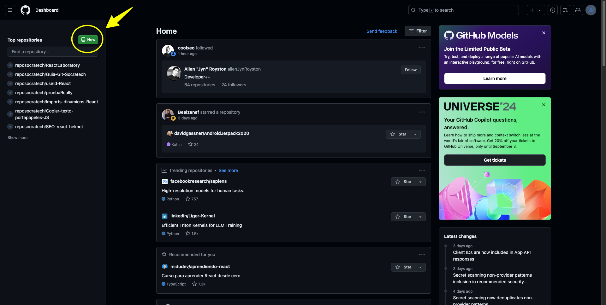

_Your repositories_


Al darle a boton de **New** se abre una vestana donde podrás poner:

- Nombre (obligatorio).
- Descripción.
- Ponerlo público o privado.
- Añadir un README.
- Añadir un archivo .gitignore (lo veremos más adelante).
- Añadir una licencia.

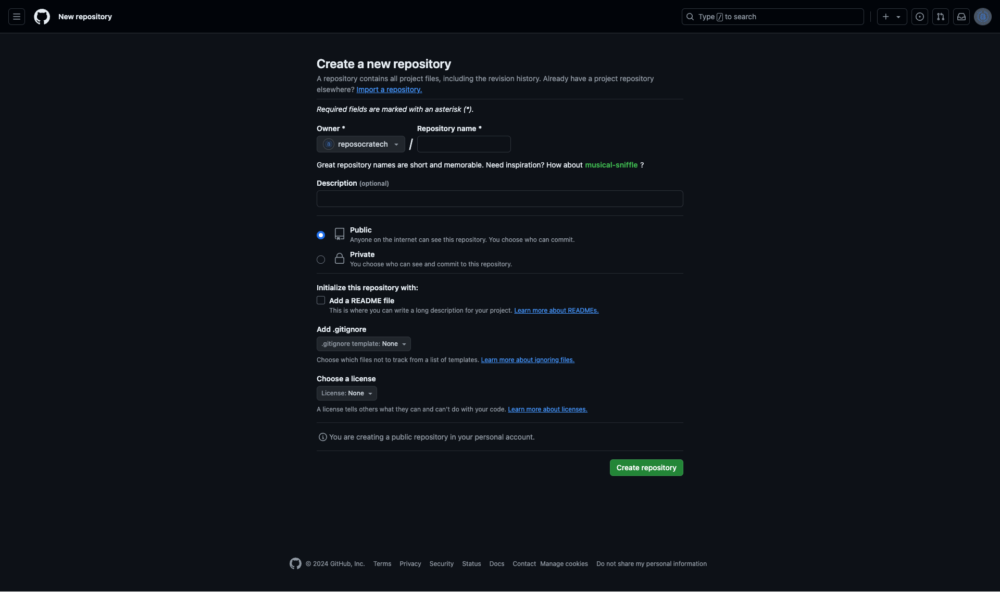

Para terminar hay que pulsar el botón **Create repository**. Estos datos los puedes modificar más adelante si lo deseas.

Tras pulsar el botón se crea el repositorio vacío y aparece la siguiente vista:

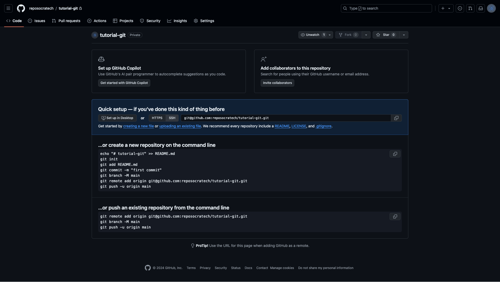

En esta vista, algunas de las cosas interesantes que aperecen son:

- La posibilidad de **añadir colaboradores**.
- La **url del repositorio**, las cual necesitamos para poder hacer la vinculación con el repositorio local y/o clonarlo. Si has configurado SSH elige esa opción y si no hazlo con HTTPS.
- **Intrucciones a seguir.** Nosotros ya tenemos creado el repositorio local, hemos añadido los archivos y creado el commit. Con `git branch -M main` renombramos la rama principal, pero no es necesario porque ya lo dejamos en la configuración global.
- Los 2 últimos comandos si los necesitamos y son los que vamos a ver a continuación.

[⬆️ Volver a inicio](#introducción)

\- **Vincular repositorios**

Una vez creados el repositorio local y el repositorio remoto, estos ya pueden ser vinculados. Para ello usaremos el siguiente comando:

```bash
git remote add origin <url-repositorio>
```

```bash
# EJEMPLO ↓
git remote add origin git@github-trabajo:reposocratech/tutorial-git.git
```

Este comando no mostrará ningún mensaje por consola, pero puedes comprobar si se ha vinculado realmenente, usando el comando:

```bash
git remote -v
```

```bash
#EJEMPLO ↓
git remote -v

# origin	git@github-trabajo:reposocratech/tutorial-git.git (fetch)
# origin	git@github-trabajo:reposocratech/tutorial-git.git (push)
```

Si intentas vincularlo de nuevo te saldrá el siguiente error:

```bash
git remote add origin git@github-trabajo:reposocratech/tutorial-git.git
# error: remoto origin ya existe.
```

[⬆️ Volver a inicio](#introducción)

\- **Subir cambios**

Una vez los repositorios están vinculados, una de las cosas que podemos hacer es subir cambios. Para ello hay que usar el comando `git push` de la siguiente manera:

```bash
git push <nombre-repositorio> <nombre-rama>
```

El **nombre del repositorio** por defecto es **origin** y en este caso vamos a subir a la **rama principal main**. Quedaría así:

```bash
git push origin main
```

Te saldrá un mensaje parecido a este informando de todo lo que ha subido.

```bash
# EJEMPLO ↓
git push origin main

# Enumerando objetos: 11, listo.
# Contando objetos: 100% (11/11), listo.
# Compresión delta usando hasta 10 hilos
# Comprimiendo objetos: 100% (11/11), listo.
# Escribiendo objetos: 100% (11/11), 1.02 MiB | 8.47 MiB/s, listo.
# Total 11 (delta 1), reused 0 (delta 0), pack-reused 0 (from 0)
# remote: Resolving deltas: 100% (1/1), done.
# To github-trabajo:reposocratech/tutorial-git.git
#  * [new branch]      main -> main
```

Si vuelves a entrar al repositorio remoto en GitHub verás que ya se han subido todos los acrhivos que había en el commit.

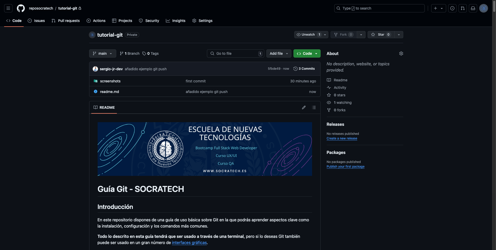

Si usas la bandera **-u** se añadirá una referencia de seguimiento a la rama y no será necesario añadir, en este caso, `origin main`. Esto habría que hacerlo en cada rama en casa de que hubiese más y quedaría así:

```bash
git push
```

[⬆️ Volver a inicio](#introducción)

\- **Clonar repositorios**

Si ves un **repositorio público o uno privado al que te hayan añadido como colaborador**, tienes la opción de poder clonarlo. Esto descargará una copia del repositorio en tu máquina, por lo que tendrás ese mismo repositorio de forma local y ya vinculado al remoto.

Para clonarlo tienes que acceder a la página del repositorio, darle al **botón "Code"** y elegir el método deseado. Lo más habitual es usar HTTPS o SSH, por lo que se haría de la siguiente manera:

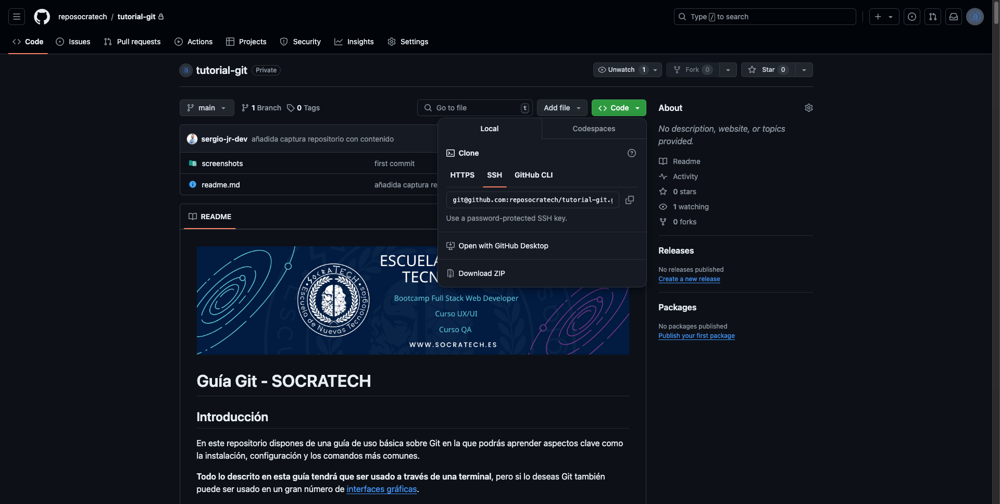

```bash
git clone git@github-trabajo:reposocratech/tutorial-git.git
```

Esto mostrará un mensaje parecido a este por la terminal:

```bash
git clone git@github-trabajo:reposocratech/tutorial-git.git

# Clonando en 'tutorial-git'...
# remote: Enumerating objects: 17, done.
# remote: Counting objects: 100% (17/17), done.
# remote: Compressing objects: 100% (14/14), done.
# remote: Total 17 (delta 3), reused 17 (delta 3), pack-reused 0 (from 0)
# Recibiendo objetos: 100% (17/17), 1.02 MiB | 2.18 MiB/s, listo.
# Resolviendo deltas: 100% (3/3), listo.
```

Tras esto ya tendrás la carpeta con el repositorio en la ruta de tu ordenador donde lo hayas clonado.

[⬆️ Volver a inicio](#introducción)

\- **Descargar cambios repositorio remoto**

Cuando tienes vinculado un repositorio local con uno remoto no solo puedes subir cambios desde el local al remoto, si no que puede darse el caso de que haya cambios en el remoto y estos tengas que descargarlso al local.

Esto puede pasar por varios motivos, por ejemplo, **se esté trabajando de forma colaborativa, se haya hecho alguna modificación desde GitHub, etc.**

Para el ejemplo voy a hacer algo sencillo. Voy a crear un **archivo "prueba.txt" desde GitHub**.

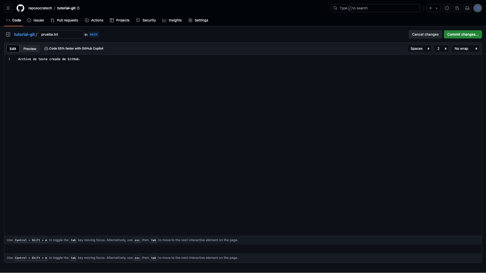

Ahora mismo el archivo "prueba.txt" está en el repositorio remoto, pero no en el local, por lo que hay que usar el comando `git pull` de la siguiente manera para descargar esos cambios.

```bash
git pull origin main
```

En este caso no hay conflictos de ningún tipo, por lo que puede hacer esa descarga sin problemas y se vería así:

```bash
#EJEMPLO ↓
git pull origin main

# remote: Enumerating objects: 4, done.
# remote: Counting objects: 100% (4/4), done.
# remote: Compressing objects: 100% (2/2), done.
# remote: Total 3 (delta 0), reused 0 (delta 0), pack-reused 0 (from 0)
# Desempaquetando objetos: 100% (3/3), 998 bytes | 499.00 KiB/s, listo.
# Desde github-trabajo:reposocratech/tutorial-git
#  * branch            main       -> FETCH_HEAD
#    e41154e..30374bd  main       -> origin/main
# Actualizando e41154e..30374bd
# Fast-forward
#  prueba.txt | 1 +
#  1 file changed, 1 insertion(+)
#  create mode 100644 prueba.txt
```

En este caso necesito descargar de la única rama que hay (main), pero podriamos hacerlo de la que necesitemos. Si al hacer el push has usado el comando `git push -u origin main` podrás hacer la descarga únicamente poniento `git pull`.

[⬆️ Volver a inicio](#introducción)

\- **Resolución de conflictos**

Si vas a descargar cambios de un archivo el cual también ha sido modificado en el repositorio local y no has realizado un commit, te saldrá el siguiente error:

```bash
# EJEMPLO ↓
git pull

# remote: Enumerating objects: 5, done.
# remote: Counting objects: 100% (5/5), done.
# remote: Compressing objects: 100% (3/3), done.
# remote: Total 3 (delta 0), reused 0 (delta 0), pack-reused 0 (from 0)
# Desempaquetando objetos: 100% (3/3), 1019 bytes | 339.00 KiB/s, listo.
# Desde github-trabajo:reposocratech/tutorial-git
#    9efece0..52aacd7  main       -> origin/main
# Actualizando 9efece0..52aacd7
# error: Los cambios locales de los siguientes archivos serán sobrescritos al fusionar:
# 	prueba.txt
# Por favor, confirma tus cambios o aguárdalos antes de fusionar.
# Abortando
```

No es posible hacer la descarga ya que tendría que sobreescribir los cambios. Veamos como podemos solucionarlo.

Actualmente en GitHub hay un commit creado en el cual el archivo "prueba.txt" está así:

.png>)

Y el mismo archivo en VS code está así:

.png>)

El mismo archivo tiene una modificación en el repositorio remoto y en el repositorio local. Ya hemos visto que si intentamos hacer un `git pull` no lo permite directamente, por lo que vamos a hacer un commit con la modificación en el repo local.

```bash
git commit -m "archivo prueba.txt"

# [main 9f5124a] archivo prueba.txt
#  3 files changed, 66 insertions(+), 3 deletions(-)
#  create mode 100644 screenshots/New-File-GitHub.png
```

Si ahora intento subir este archivo seguiré teniendo un error, veremos que pasa:

```bash
git push

# Enter passphrase for key '/Users/sergio/.ssh/id_rsa_trabajo':
# To github-trabajo:reposocratech/tutorial-git.git
#  ! [rejected]        main -> main (non-fast-forward)
# error: falló el empuje de algunas referencias a 'github-trabajo:reposocratech/tutorial-git.git'
# hint: Updates were rejected because the tip of your current branch is behind
# hint: its remote counterpart. If you want to integrate the remote changes,
# hint: use 'git pull' before pushing again.
# hint: See the 'Note about fast-forwards' in 'git push --help' for details.
```

Sigue sin poder hacerse porque hay 2 commits que afectan al mismo archivo y Git recomienda hacer `git pull`, veamos:

```bash
git pull

# Enter passphrase for key '/Users/sergio/.ssh/id_rsa_trabajo':
# hint: Las ramas se han divergido y hay que especificar cómo reconciliarlas.
# hint: Se puede hacerlo ejecutando uno de los comandos siguiente antes del
# hint: próximo pull:
# hint:
# hint:   git config pull.rebase false  # fusionar
# hint:   git config pull.rebase true   # rebasar
# hint:   git config pull.ff only       # solo avance rápido
# hint:
# hint: Se puede reemplazar "git config" con "git config --global" para aplicar
# hint: la preferencia en todos los repositorios. También se puede pasar
# hint: --rebase, --no-rebase o --ff-only en el comando para sobrescribir la
# hint: configuración por defecto en cada invocación.
# fatal: Necesita especificar cómo reconciliar las ramas divergentes.
```

Parece que ya es posible, pero no por defecto. Al haber un commit en el repositorio remoto y otro en el repositorio local afectando al mismo archivo **necesitamos fusionarlos** y hay que decirle a Git como. Nos ofrece 3 opciones:

1. **git config pull.rebase false (fusionar)**

   Hace una **fusión (merge)** para integrar los cambios desde la rama remota en tu rama local.

   Crea un **commit** de fusión si hay cambios en ambas ramas (local y remota). Esto significa que, si tu rama local ha tenido cambios desde la última vez que sincronizaste, Git **combinará esos cambios con los de la rama remota**, y el resultado será un commit adicional que representa la fusión de ambas historias.

   Este enfoque mantiene la historia completa de ambas ramas, lo que a veces puede hacer que el historial sea un poco más complicado, ya que puede incluir commits de fusión.

2. **git config pull.rebase true (rebasar)**

   Hace un **rebase** en lugar de una fusión.

   En lugar de combinar las historias de ambas ramas, el rebase **mueve los commits locales sobre los commits traídos de la rama remota**. Esto crea una historia lineal, como si los cambios locales hubieran ocurrido después de los cambios remotos.

   El historial es más limpio y lineal, pero este enfoque **puede ser más peligroso si no se entiende bien, ya que reescribe la historia local**.

3. **git config pull.ff only (solo avance rápido)**

   Solo permita una fusión por avance rápido (fast-forward).

   Un avance rápido **ocurre cuando los cambios de la rama remota pueden aplicarse directamente sobre tu rama local sin crear commits adicionales**. Esto solo es posible si no has hecho cambios en tu rama local desde la última vez que sincronizaste.

   Este enfoque mantiene un historial limpio y directo, sin crear commits de fusión ni reescribir la historia, pero solo funciona si tu rama local no tiene commits adicionales que no estén en la rama remota.

Se podría aplicar una configuración global, pero yo prefiero poder elegir en cada repositorio.

En esta ocasión eligiré `git config pull.rebase false` ya que suele ser la más sencilla y la más utilizada, por lo que quedaría así.

```bash
git config pull.rebase false
```

> Aplica la configuración para este repositorio.

Vuelvo a hacer `git pull` y sucede esto:

```bash
git pull

# Enter passphrase for key '/Users/sergio/.ssh/id_rsa_trabajo':
# Auto-fusionando prueba.txt
# CONFLICTO (contenido): Conflicto de fusión en prueba.txt
# Fusión automática falló; arregle los conflictos y luego realice un commit con el resultado.
```

Como en este caso ha sido modificado el mismo archivo en la misma línea se ha generado un **conflicto**, por lo que hay que solucionarlo en el editor.


En verde aparece el estado actual y en azul lo que he modificado desde Github. Arriba aparecen unos botones para poder elegir con que quedarnos. En este caso será "Aceptar ambos cambios".

Tras esto hay que crear un commit y subir los cambios.

```bash
# EJEMPLO ↓

git add .

git commit -m "resolución conflictos prueba .txt"
# [main d03065f] resolución conflictos prueba .txt

git push origin main
# Enumerando objetos: 22, listo.
# Contando objetos: 100% (20/20), listo.
# Compresión delta usando hasta 10 hilos
# Comprimiendo objetos: 100% (14/14), listo.
# Escribiendo objetos: 100% (14/14), 215.24 KiB | 1.96 MiB/s, listo.
# Total 14 (delta 5), reused 0 (delta 0), pack-reused 0 (from 0)
# remote: Resolving deltas: 100% (5/5), completed with 2 local objects.
# To github-trabajo:reposocratech/tutorial-git.git
#    52aacd7..d03065f  main -> main
---
```

De esta forma queda solucionado el conflicto y el archivo "prueba.txt" conserva ambas líneas.


[⬆️ Volver a inicio](#introducción)

### Ramas

Hasta ahora todos los cambios realizados se han hecho en un repositorio manejado por **una sola persona** y directamente en la **rama principal main**, por lo que todos los cambios se han ido realizando de manera **lineal**.

Esto puede estar bien si son proyectos propios y no muy grandes, pero si queremos ir separando el trabajo, por ejemplo, en **funcionalidades** o queremos **trabajar de forma conjunta con otros desarrolladores** es posible que necesitemos **crear nuevas ramas** para no trabajar siempre en main.

Al crear nuevas ramas podremos **trabajar de forma paralela en el mismo código** sin afectar al resto, por lo que **por cada rama se creará una bifurcación**.

Una vez hemos trabajado en estas nuevas ramas podremos **fusionarlas con otras o desecharlas**.

Veamos todo el proceso.

\- **Crear nueva rama y moverte a ella**

Lo primero será crear una nueva rama, ya que por defecto solo tenemos la principal (main). Una de las formas de crear una rama sería:

```bash
git branch pruebas
```

> Con el comando `git branch` podremos crear, listar y borrar ramas. En este caso la creamos poniendo el comando seguido del nombre.

Si intentas crear una rama con un nombre que ya existe recibirás el siguiente error:

```bash
# EJEMPLO ↓

git branch pruebas
# fatal: una rama llamada 'pruebas' ya existe
```

Con esto tan solo hemos creado la rama "pruebas", pero si queremos movernos a ella tenemos las siguientes opciones:

```bash
git swith pruebas
```

Al cambiarte de rama verás el siguiente mensaje:

```bash
# EJEMPLO ↓

git switch pruebas
# Cambiado a rama 'pruebas'
```

También tienes la posibilidad de cambiar entre la rama actual y la anterior de la cual venías con el comando:

```bash
git switch -
```

Si intentas cambiarta a la rama en la que estás actualmente verás el siguiente mensaje:

```bash
# EJEMPLO ↓

git switch pruebas
# Ya en 'pruebas'
```

Si intentas cambiar a una rama que no existe verás el siguiente error:

```bash
# EJEMPLO ↓

git switch otra-rama
# fatal: referencia inválida: otra-rama
```

> `git switch` es un comando moderno y recomendado, **disponible desde Git 2.23**, es más intuitivo y pretende sustituir a como ya se podía hacer con el comando `git checkout`.

```bash
git checkout pruebas
```

Con esto abremos cambiado a la rama "pruebas". Pero estos comandos también nos dan la posibilidad de crear una nueva rama y además movernos a ella en un solo paso.

```bash
git switch -c pruebas
```

> `git switch` es un comando moderno y recomendado, **disponible desde Git 2.23**, es más intuitivo y pretende sustituir a como ya se podía hacer con el comando `git checkout`.

```bash
git checkout -b pruebas
```

Con estos 2 últimos comandos creamos una rama y nos cambiamos directamente a ella.

[⬆️ Volver a inicio](#introducción)

\- **Listar ramas**

Una vez hay más de una rama creada es posible que te interese listarlas para ver cuales hay y cual es la rama actual. Para ello tan solo hay que usar:

```bash
git branch
```

Esto te mostrará el listado de ramas y con un \* te indica la rama actual.

```bash
#EJEMPLO ↓

git branch
#  main
# * pruebas
```

Si directamente lo único que quieres ver es cuál es la rama catuar, puedes usar el comando:

```
git branch --show-current
```

[⬆️ Volver a inicio](#introducción)

\- **Trabajando con ramas**

Ha llegado el momento de trabajar con ramas. Para ello he empezado el repositorio de 0 con un solo commit y he creado la rama "pruebas. El proceso a sido el siguiente:

```bash
# EJEMPLO ↓

git init
# Inicializado repositorio Git vacío en /Users/sergio/Desktop/Códigos/Clases/Git/Tutorial/.git/
git add.
git commit -m "first commit"
# [main (commit-raíz) 4edc7e7] first commit
#  1 file changed, 4 insertions(+)
#  create mode 100644 prueba.txt
git switch -c pruebas
# Cambiado a nueva rama 'pruebas'
```

Si hago un `git log` podremos ver como HEAD está tanto en al rama "main" como en la rama "pruebas", ya que ambas comparten en el mismo commit "first commit".

```bash
# EJEMPLO ↓

git log --graph
# * commit 4edc7e7864e278c9cd063aaf60fd9610c2897a50 (HEAD -> pruebas, main)
#   Author: sergio jimenez <sjr.social@gmail.com>
#   Date:   Thu Sep 5 13:29:06 2024 +0200
#
#       first commit
```

Lo único que hay actualmente en el repositorio y que comparten ambas ramas en el archivo "prueba.txt" el cual se encuentra así:


Ahora voy a crear un nuevo archivo desde la rama "pruebas" llamado "archivo2.txt" y voy a hacer un nuevo commit añadiéndolo. También voy a volver a la rama "main" para crear el archivo "archivo3.txt" y hacer un nuevo commit.

```bash
# EJEMPLO ↓

git add .
git commit -m "añadido archivo archivo2.txt"
# [pruebas 2f45b17] añadido archivo archivo2.txt
#  1 file changed, 1 insertion(+)
#  create mode 100644 archivo2.txt
git switch -
# Cambiado a rama 'main'
git add .
git commit -m "añadido archivo archivo3.txt"
# [main 989b01e] añadido archivo archivo3.txt
#  1 file changed, 1 insertion(+)
#  create mode 100644 archivo3.txt
```

De esta manera ahora en la rama "main" está el archivo "prueba.txt" y el archivo "archivo3.txt", pero no está el archivo "archivo2.txt".

Y en la rama "pruebas" está el archivo "prueba.txt" y el archivo "archivo2.txt", pero no está el archivo "archivo3.txt".

Por lo que el primer commit "first commit" era compartido por ambas ramas, pero ahora cada rama tiene un nuevo commit y estas an divergido y se ve así.


Si estamos de acuerdo con el contenido añadido en la rama "pruebas" sería la hora de hacer un merge (fusionar) y así poder trasladar el archivo "archivo2.txt" a la rama "main".

Para ello podemos hacerlo desde git con el comando `git merge` o hacer una PR al repositorio remoto y gestionarlo desde GitHub. Ahora lo haremos la primera opción.

Para ello confirmo que estoy en la rama "main" y si no me muevo a ella, para después hacer un merge de la rama "pruebas".

```bash
# EJEMPLO ↓

git branch --show-current
# main
git merge pruebas
# ayuda: Esperando que tu editor cierre el archivo Merge made by the 'ort' strategy.
#  archivo2.txt | 1 +
#  1 file changed, 1 insertion(+)
#  create mode 100644 archivo2.txt
```

Para hacer el merge Git hará otro commit que incluya todos los cambios, por lo que se abre el editor para modificar el mensaje.

Si hubiese conflictos los podriamos solucionar como vimos en la sección de repositorios remotos.

Ahora en la rama "main" tenemos el archivo "archivo2.txt" que se creó en la rama "pruebas". Ahora podriamos borrar la rama "pruebas" si ya no más cambios a realizar o podemos hacer un mergeo paar que traiga el archico "archivo3.txt" de main.

En mi caso voy a hacer el merge, ya que quiero volver a añadir cambios para está vez hacer una PR y hacer el mergeo desde el repositorio remoto en GitHub.

```bash
git switch -
# Cambiado a rama 'pruebas'
git merge main
# Actualizando 2f45b17..2cfe5f0
# Fast-forward
#  archivo3.txt | 1 +
#  1 file changed, 1 insertion(+)
#  create mode 100644 archivo3.txt
```

Una vez tengo ambas ramas con la misma información, voy a subir los cambios de "main" al repositorio remoto para despues añadir cambios desde "pruebas".

```bash
# EJEMPLO ↓

git switch -
# Cambiado a rama 'main'
git push origin main
# Enumerando objetos: 9, listo.
# Contando objetos: 100% (9/9), listo.
# Compresión delta usando hasta 10 hilos
# Comprimiendo objetos: 100% (6/6), listo.
# Escribiendo objetos: 100% (8/8), 787 bytes | 787.00 KiB/s, listo.
# Total 8 (delta 2), reused 0 (delta 0), pack-reused 0 (from 0)
# remote: Resolving deltas: 100% (2/2), done.
# To github-trabajo:reposocratech/ejemplos-git.git
#    4edc7e7..2cfe5f0  main -> main
git switch -
# Cambiado a rama 'pruebas'
```

Una vez subidos los cambios de la rama "main" al repositorio remoto podemos comprobar que todo está ok y seguir haciendo cambios en la rama "pruebas".

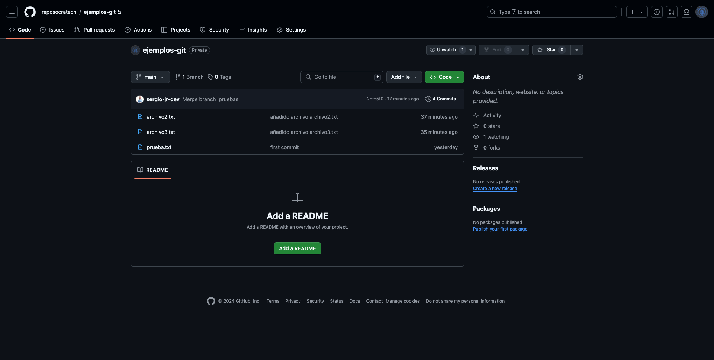

Por ejemplo, voy a editar el archivo "archivo3.txt" que actualmente está así:


Y le voy a añadir una nueva línea de código debajo de la línea uno, por lo que no generará conflicto alguno. El archivo quedaría así:

.png>)

Ahora haré un nuevo commit con este cambio y haré un `git push` a la rama "pruebas" para fusionarla desde GitHub.

```bash
# EJEMPLO ↓

git add .
git commit -m "modificado archivo3.txt"
# [pruebas aed6430] modificado archivo3.txt
#  1 file changed, 2 insertions(+), 1 deletion(-)
git push origin pruebas
# Enumerando objetos: 5, listo.
# Contando objetos: 100% (5/5), listo.
# Compresión delta usando hasta 10 hilos
# Comprimiendo objetos: 100% (3/3), listo.
# Escribiendo objetos: 100% (3/3), 381 bytes | 381.00 KiB/s, listo.
# Total 3 (delta 0), reused 0 (delta 0), pack-reused 0 (from 0)
# remote:
# remote: Create a pull request for 'pruebas' on GitHub by visiting:
# remote:      https://github.com/reposocratech/ejemplos-git/pull/new/pruebas
# remote:
# To github-trabajo:reposocratech/ejemplos-git.git
#  * [new branch]      pruebas -> pruebas
```

Ya se han subido los cambios a la rama remota "pruebas", por lo que es hora de ir a GitHub y ver cómo hacer la PR y el merge.

Al entrar al repositorio aparecerá un banner con un botón **"Compare & pull request"**. Veamos que sucede al hacer clic en el.

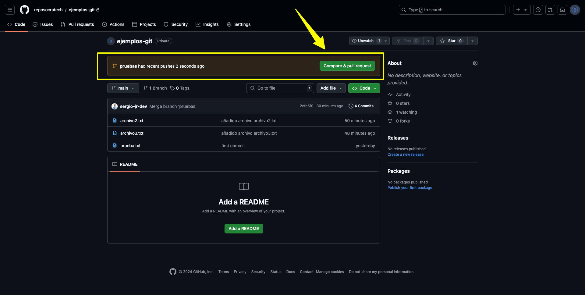

Se nos mostrará la siguiente vista en la que podemos ver cosas como:

- Comparar entre 2 ramas. En este caso ya nos aparece que será desde la rama "pruebas" a la rama "main", pero se puede cambiar.
- Título del commit.
- Descripción del commit.
- Cambios realizados.

.png>)

También volvemos a tener otro botón de color verde **"Create pull request"** para crear la PR. En este caso lo podemos hacer directamente, pero también en posible que en otros proyectos tenga que ser revisada por alguien más y te la tengan que aceptar.

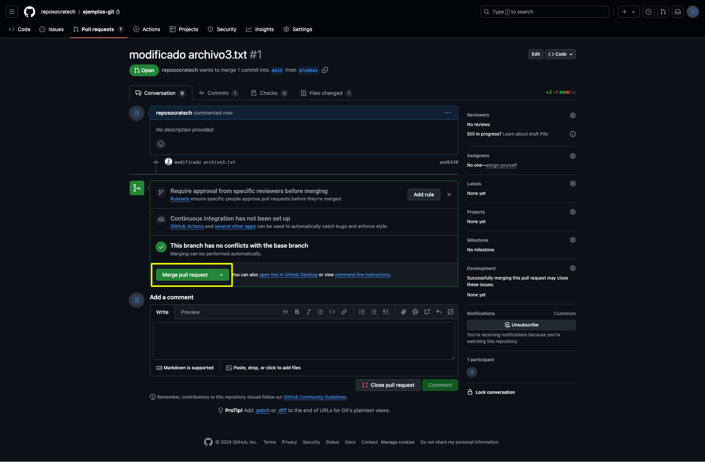

Aquí si no hay conflictos para solucionar saldrá el botón **"Mege pull request"** para hacer el merge. Si hay conflictos los podremos solucionar desde GitHub (lo veremos después) o desde el editor (lo hemos visto en la sección de repositorios remotos).

.png>)

Por último nos vuelve a dejar modificar título y descripción del commit y aparece el boton **"Confirm merge"**.

Una vez confirmado nos da la opción de borrar la rama y los cambios ya se habrán fusionado con los de la rama "main".

.png>)

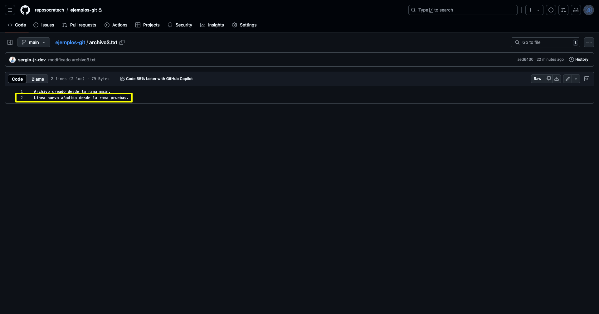

[⬆️ Volver a inicio](#introducción)

Ahora haré una modificación que genere un conflicto. Voy a modificar el archivo "pruebas.txt" y tanto desde "main" como desde pruebas añadire´ nuevo código en la línea 6. El archivo queda así:

Main:


Pruebas:
.png>)

Ambos archivos tienen nuevo código en la misma línea. Primero modifico el archivo y creo el commit en "main" y lo subo al repo remoto. Luego modifico archivo y creo el commit en "pruebas" y lo subo al repo remoto.

Ahora vayamos a GitHub a realizar la PR y el merge a ver qué sucede.

Al ir a confirmar el merge nos sale la misma pantalla de antes, pero el botón **"Merge pull request"** está desabilitado y sale un nuevo botón **"Resolve conflicts"** en el que tenemos que hacer clic.

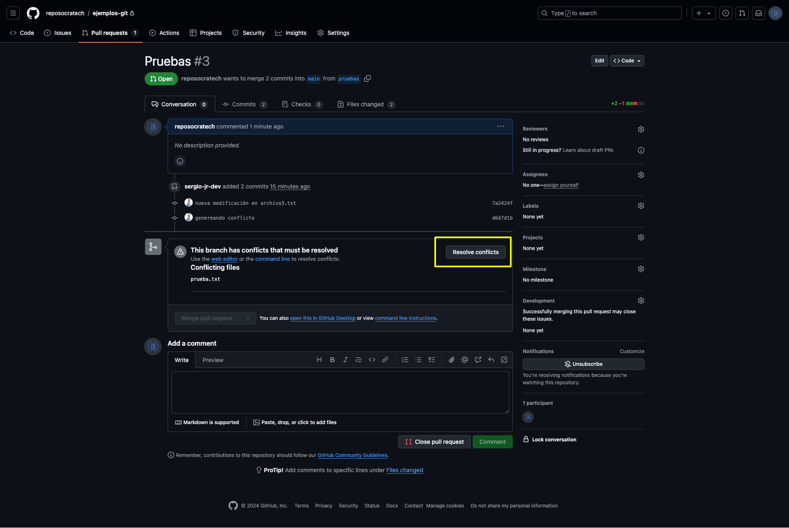

En este caso solo tenemos conflictos en un archivo. Si son pocos conflictos se podrán solucionar desde GitHub, pero si hay muchos es posible que te obligue a solucionarlos desde el editor.

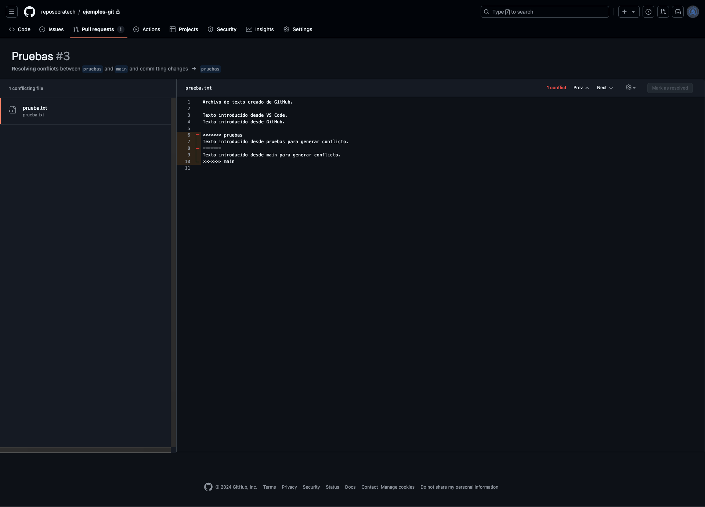

Sale indicado con comentarios lo introducido en la rama "main" y en la rama "pruebas". En este caso quiero mantener las líneas 7 y 9 y borraré los comentarios de las líneas 6, 8 y 10. Tras esto se habilita el botón **"Mark as resolver"**.

.png>)

Una vez marcados todos los conflictos como resueltos se habilita el botón **"Commit merge"**.

.png>)

Y ahora ya se habilita de nuevo el botón **"Merge pull request"** para finalizar el merge.

.png>)

Con esto ya sabes como hacer merge desde Git y desde GitHub con una PR y como solucionar conflictos tanto desde el editor como desde GitHub.

Veamos el siguiente paso.

\- **Borrar una rama**

Normalmente, una vez hayas acabado de trabajar en una rama querrás borrarla. Si no hay modificaciones pendientes puedes usar el comando:

```bash
git branch -d <nombre-rama>
```

> Para poder borrar una rama tendrás que asegurante de que no estás en ella.

Si hay cambios pendientes de mergear te saldrá el siguiente aviso y te dirá que uses la bandera **-D** para forzar el borrado.

```bash
# EJEMPLO ↓

git branch -d pruebas
# error: the branch 'pruebas' is not fully merged
# hint: If you are sure you want to delete it, run 'git branch -D pruebas'
# hint: Disable this message with "git config advice.forceDeleteBranch false"
```

Una vez eliminada correctamente te saldrá lo siguiente.

```bash
# EJEMPLO ↓

git branch -D pruebas
# Eliminada la rama pruebas (era d6d7d1b).
```

Si también deseas borrar la rama remota puedes acerlo directamente desde Github o con el comando:

```bash
git push origin --delete <nombre-rama>
```

```bash
# EJEMPLO ↓

git push origin --delete pruebas
# Enter passphrase for key '/Users/sergio/.ssh/id_rsa_trabajo':
# To github-trabajo:reposocratech/ejemplos-git.git
#  - [deleted]         pruebas
```

### Stash

En desarrollo...

### Alias

En desarrollo...

## Ignorar archivos

Otro aspecto que tendrás que tener controlado es el de **ignorar archivos en Git**, porque no siempre querrás que absoluatemente todo llegue al remoto.

Por ejemplo, no se recomienda subir la carpeta "node_modules" o los archivos de varibales de entorno ".env".

Para **ignorar archivos en repositorio en concreto**, tan solo tienes crear un archivo ".gitignore" y añadir en el lo que quieres ignorar. Por ejemplo:

```
node_modules # La carpeta node_modules
.env # Fichero .env con variables de entorno
.DS_Store # Archivo de Mac OS
*.log # Todos los ficheros con extensión .log
```

Hay muchos patrones para ignorar archivos y carpetas, os dejo un [artículo de Atlassian donde explican todas las opciones](https://www.atlassian.com/es/git/tutorials/saving-changes/gitignore).

Si lo prefieres también puedes crear el archivo .gitignore con un [generador](https://www.toptal.com/developers/gitignore).

> En VS code los archivos ignorados saldrán en gris.

También es posible **ignorar archivos de manera global** en todos los repositorios. Para ello debes crear el archivo .gitignore_global en la raiz del sistema `~/.gitignore_global` con los patrones de los archivos quieras ignorar y añadirlo en la configuración de Git con el comando `git config --global core.excludesfile ~/.gitignore_global`.

[⬆️ Volver a inicio](#introducción)

## Preguntas frecuentes

### Preguntas sobre Git

<details>
  <summary>¿Qué es Git?</summary>

- Git es un sistema de control de versiones distribuido que permite a varios desarrolladores trabajar en un proyecto sin sobrescribir los cambios de los demás, manteniendo un historial detallado de los cambios.
</details>

<details>
  <summary>¿Cuál es la diferencia entre Git y otros sistemas de control de versiones?</summary>

- A diferencia de sistemas centralizados, Git es distribuido, lo que significa que cada desarrollador tiene una copia completa del historial del proyecto. Esto permite trabajar de forma independiente y fusionar los cambios más adelante.
</details>

<details>
  <summary>¿Qué es un “commit” en Git?</summary>

- Un commit es una instantánea de los cambios en el código. Sirve para guardar un conjunto específico de modificaciones con un mensaje que describe el propósito del cambio.
</details>

<details>
  <summary>¿Qué es un “commit” en Git?</summary>

- Un commit es una instantánea de los cambios en el código. Sirve para guardar un conjunto específico de modificaciones con un mensaje que describe el propósito del cambio.
</details>

<details>
  <summary>¿Qué es un “branch” o rama en Git?</summary>

- Una rama es una línea de desarrollo independiente. Se utiliza para aislar el trabajo en diferentes funcionalidades o correcciones, y luego se puede fusionar con la rama principal.
</details>

<details>
  <summary>¿Cómo puedo ver el historial de commits en Git?</summary>

- Usando el comando `git log`, puedes ver el historial de commits en un repositorio, junto con los mensajes asociados y otros detalles como el autor y la fecha.
</details>

<details>
  <summary>¿Qué significa “stash” en Git?</summary>

- El comando `git stash` guarda temporalmente los cambios no confirmados en una pila para que puedas cambiar a otra rama sin necesidad de hacer commit o perder tu trabajo.
</details>

<details>
  <summary>¿Qué es el “merge” y el “rebase”?</summary>

- `git merge` combina dos ramas, creando un commit de fusión. `git rebase` integra cambios de una rama a otra reescribiendo el historial, lo que da como resultado un historial más lineal.
</details>

<details>
  <summary>¿Cómo puedo deshacer cambios en Git?</summary>

- Puedes usar `git reset`, `git checkout` o `git revert`, dependiendo de si deseas deshacer un commit, descartar cambios en archivos o revertir cambios específicos.
</details>

<details>
  <summary>¿Qué es un conflicto en Git?</summary>

- Un conflicto ocurre cuando dos desarrolladores modifican la misma línea de código de manera diferente.
</details>

<details>
  <summary>¿Cuál es la diferencia entre un repositorio local y un repositorio remoto?</summary>

- **Repositorio local**: Es una copia del proyecto almacenada en la computadora del desarrollador.
- **Repositorio remoto**: Es una copia del proyecto almacenada en un servidor, como GitHub, y accesible a otros desarrolladores.
</details>

### Preguntas sobre GitHub

<details>
  <summary>¿Qué es GitHub?</summary>

- GitHub es una plataforma de desarrollo colaborativo basada en Git. Permite a los desarrolladores alojar repositorios, colaborar en proyectos, y utilizar herramientas para revisión de código, control de versiones, y CI/CD.
</details>

<details>
  <summary>¿Qué es un “pull request” (PR)?</summary>

- Un pull request es una solicitud para que se revisen y potencialmente se fusionen los cambios de una rama en otra (generalmente de una rama de características o fix a la rama principal).
</details>

<details>
  <summary>¿Cuál es la diferencia entre un “fork” y un “clone” en GitHub?</summary>

- Hacer un fork crea una copia independiente del repositorio en tu cuenta de GitHub, mientras que clonar solo copia el repositorio localmente. Un fork es útil cuando quieres contribuir a un proyecto en el que no tienes permisos de escritura.
</details>

<details>
  <summary>¿Qué es GitHub Actions?</summary>

- GitHub Actions es una herramienta de integración continua (CI) y entrega continua (CD) que permite automatizar flujos de trabajo, como la ejecución de pruebas o el despliegue de código.
</details>

<details>
  <summary>¿Cómo contribuyo a un repositorio en GitHub?</summary>

- Generalmente, haces un fork del repositorio, creas una nueva rama, haces tus cambios, y luego creas un pull request para que el propietario del proyecto revise y acepte tus cambios.
</details>

<details>
  <summary>¿Cómo puedo configurar las ramas protegidas en GitHub?</summary>

- En la configuración de un repositorio, puedes habilitar ramas protegidas para evitar que se hagan commits directamente, forzando a que cualquier cambio pase por revisión mediante pull requests.
</details>

<details>
  <summary>¿Qué es un “gist” en GitHub?</summary>

- Un gist es una manera rápida de compartir fragmentos de código o archivos a través de GitHub, que puede ser público o privado.
</details>

<details>
  <summary>¿Cómo resuelvo conflictos de merge en GitHub?</summary>

- Los conflictos de merge ocurren cuando Git no puede fusionar automáticamente los cambios. Debes resolver los conflictos manualmente editando los archivos en conflicto y luego hacer commit de la resolución.
</details>

---

[⬆️ Volver a inicio](#introducción)

Si te ha gustado esta guía guárdate el repositorio como favorito dándole a la ⭐️ y compártela con tus conocidos.

## Descubre más sobre nosotros

[ ](https://socratech.es)
[ ](https://www.linkedin.com/company/escuela-socratech)
[ ](https://twitter.com/socratech_)
[ ](https://www.instagram.com/socratechescuela/)
[ ](https://www.facebook.com/SocraTech-106357911679909/)
[ ](https://www.youtube.com/channel/UCP0nrDXWANd_H7WkGlrWJcg)
